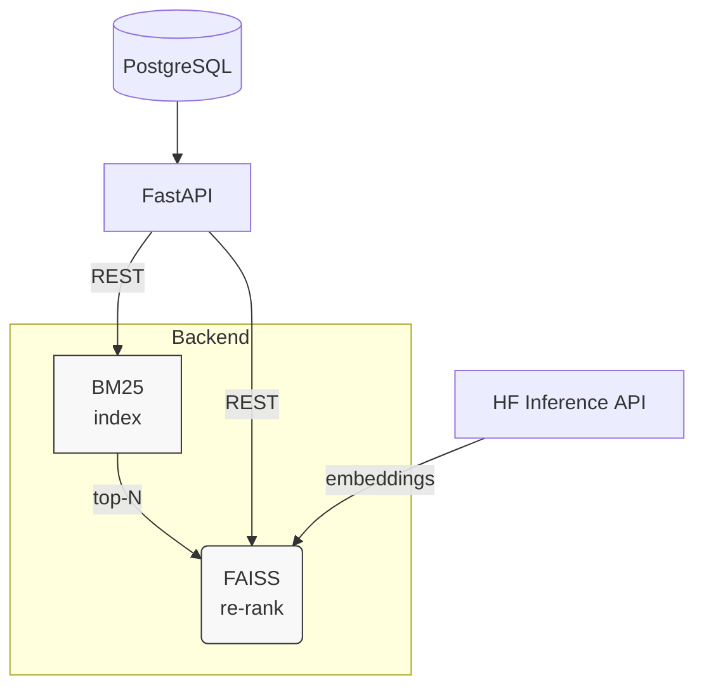

# Course-paper-233-2025
Kuznetsov Maxim 233 DSBA 2025


# Semantic News Search API

A lightweight hybrid search engine for a Russian news corpus.
The backend mixes **BM25**, **FAISS with light SOTA  embeddings** and optional **GPT query augmentation**, 
Backend is on FastAPI REST with static demo site

<p align="center">
  
  
  
</p>

---

## Features

* **Hybrid retrieval** — BM25 top‑N → FAISS BERTA cosine rerank  
* **Fast indexing** with `/api/news` — document is searchable in &lt;1 s  
* **Query expansion** (optional) through OpenRouter that uses most effective provider  

---

## Repository layout

```
API_search_engine/
├── controllers/
│   └── router.py        # all endpoints and business logic
├── data/                # persisted indices
│   ├── bm25_state.pkl
│   ├── faiss.index
│   └── faiss_doc_ids.json
├── search_engine/
│   ├── bm25.py
│   ├── faiss_index.py
│   └── utils.py
├── static/              # demo single page html
├── main.py              
├── seed_random_news.py  # fill demo DB with 10k random articles
└── requirements.txt
```


## Quick start

### 1. Clone and prepare `.env`

```bash
git clone https://github.com/your‑org/semantic‑news‑search.git
cd semantic‑news‑search

```

**Minimal `.env`**

```env
PG_USER=postgres
PG_PASS=postgres
PG_HOST=localhost
PG_PORT=5432
PG_DB=news
HF_TOKEN=your_huggingface_token
OPENROUTER_KEY=your_openrouter_api_key
```

### 2. Launch PG in Docker

```bash
docker run -d --name news_pg \
  -e POSTGRES_DB=news \
  -e POSTGRES_USER=postgres \
  -e POSTGRES_PASSWORD=postgres \
  -p 5432:5432 \
  -v pgdata:/var/lib/postgresql/data \
  postgres:16-alpine
```

### 3. (Optional) Seed 10 k random news

```bash
python -m pip install -r requirements.txt
python seed_random_news.py
```

### 4. Start the API server

```bash
uvicorn main:app --reload --host 0.0.0.0 --port 8000
```
Can be route out with nginx (or for tests by vscode port routing)

---

## Using links

| Action | URL |
|--------|---------------|
| **Demo SPA** | <http://localhost:8000/> |
| **Swagger UI** | <http://localhost:8000/docs> |
| **ReDoc** | <http://localhost:8000/redoc> |


---

## Architecture



---

## Production notes

* Now all the data for search are in `data/`; it's better to mount a volume in Docker/K8s.  
* For higher token generation speed better to change HuggingFace API to a local sentence transformer model.

---
